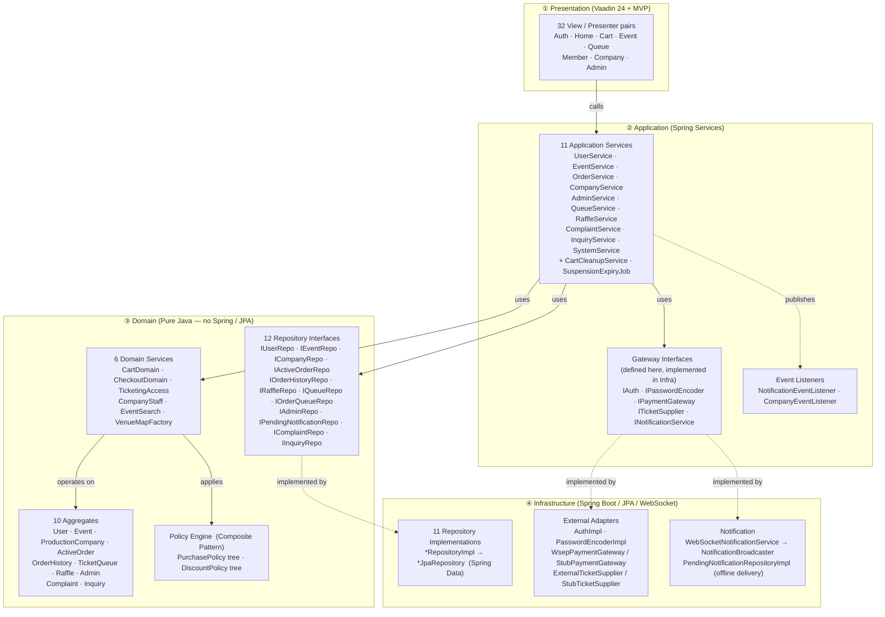
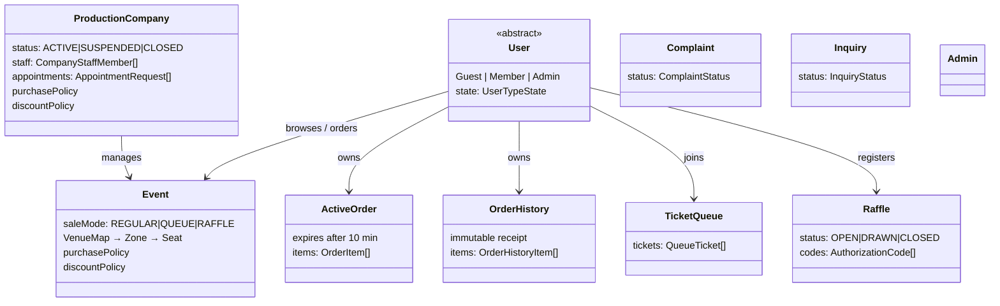
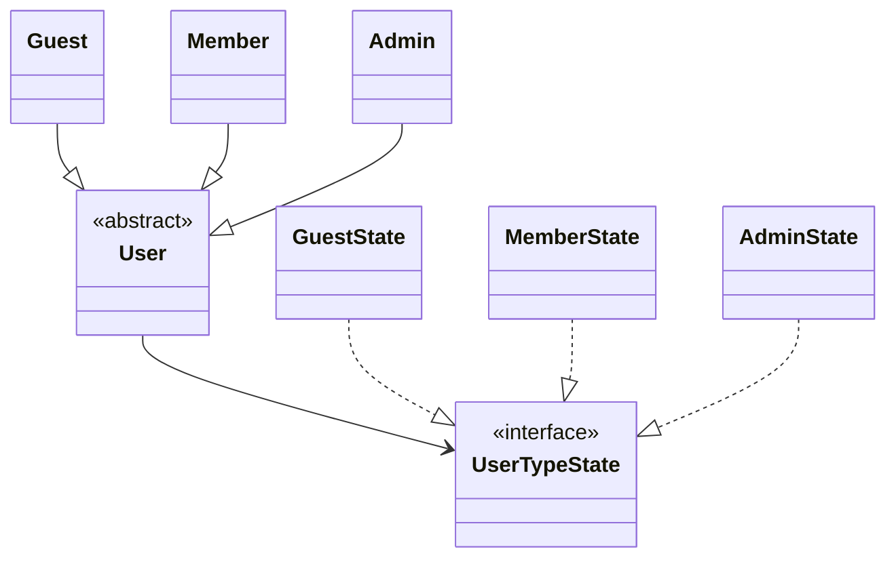
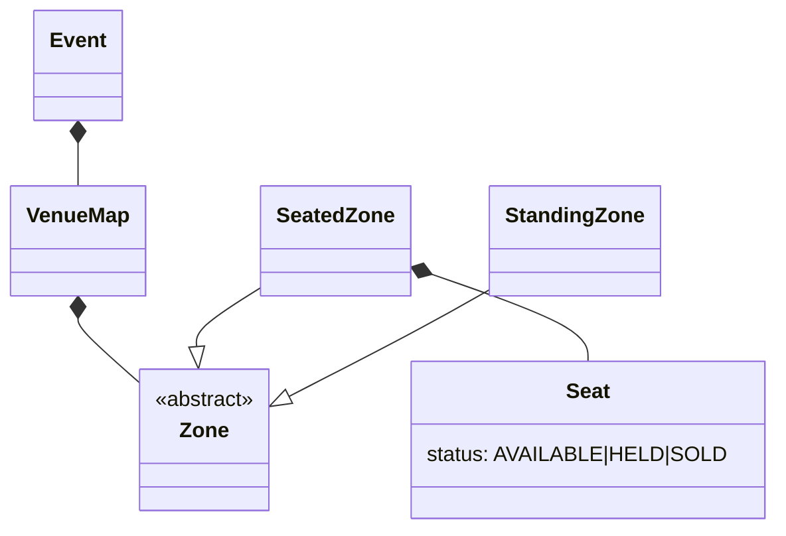
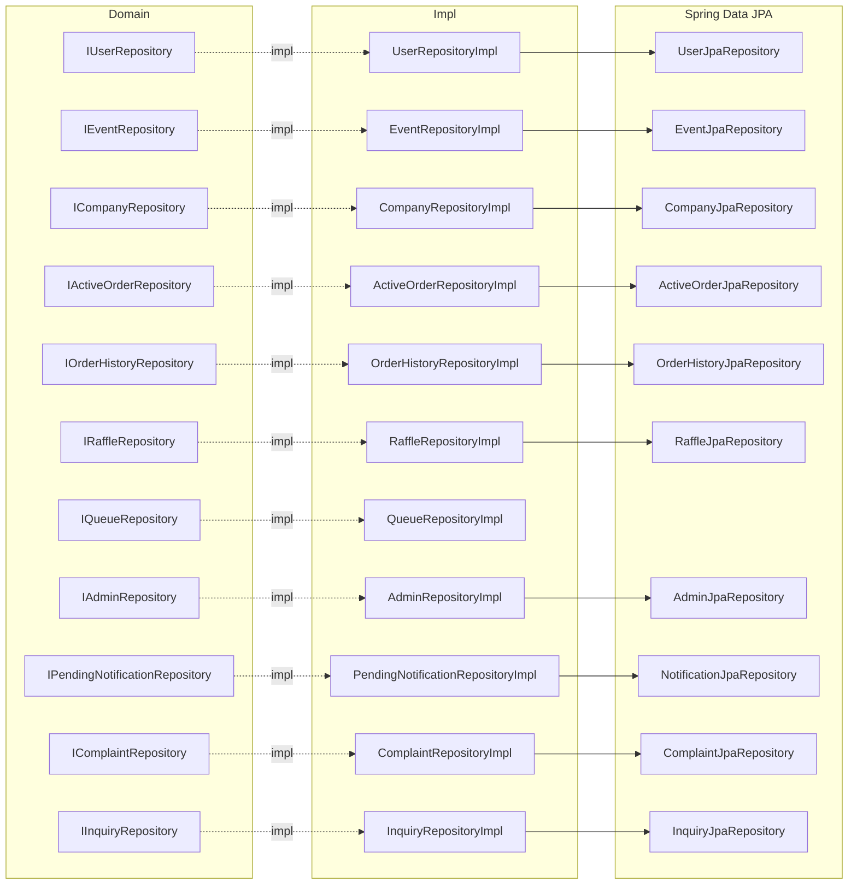
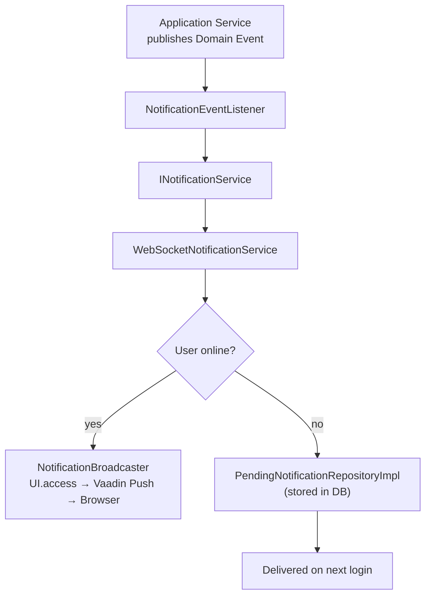

# System UML — Event Ticketing Platform (Group 13A)

---

## 1. Architecture Overview

Four-layer clean architecture. Dependency arrows always point **inward** — outer layers depend on inner layers, never the reverse.

---

## 2. Domain Aggregates

Each box is an **Aggregate Root** — the only external entry point. Children are owned exclusively by the root.

### User Aggregate — State Pattern

### Event Aggregate — Venue Structure

---

## 3. Policy Engine  (Composite Pattern)

Both trees can be composed to arbitrary depth. `Event` and `ProductionCompany` each carry one `PurchasePolicy` root and one `DiscountPolicy` root. Serialized to JSON for persistence.

```mermaid
classDiagram
    class PurchasePolicy { <<interface>> evaluate(ctx) bool }
    class AllowAllPolicy
    class AgeRestrictionPolicy
    class MinTicketsPolicy
    class MaxTicketsPolicy
    class AndPolicy { children: PurchasePolicy[] }
    class OrPolicy  { children: PurchasePolicy[] }

    AllowAllPolicy      ..|> PurchasePolicy
    AgeRestrictionPolicy ..|> PurchasePolicy
    MinTicketsPolicy    ..|> PurchasePolicy
    MaxTicketsPolicy    ..|> PurchasePolicy
    AndPolicy           ..|> PurchasePolicy
    OrPolicy            ..|> PurchasePolicy
    AndPolicy *-- PurchasePolicy
    OrPolicy  *-- PurchasePolicy

    class DiscountPolicy { <<interface>> calculate(ctx) double }
    class NoDiscountPolicy
    class SimpleDiscount
    class ConditionalDiscount
    class CouponDiscount
    class MaxDiscountPolicy   { children: DiscountPolicy[] }
    class AdditiveDiscountPolicy { children: DiscountPolicy[] }

    NoDiscountPolicy        ..|> DiscountPolicy
    SimpleDiscount          ..|> DiscountPolicy
    ConditionalDiscount     ..|> DiscountPolicy
    CouponDiscount          ..|> DiscountPolicy
    MaxDiscountPolicy       ..|> DiscountPolicy
    AdditiveDiscountPolicy  ..|> DiscountPolicy
    MaxDiscountPolicy      *-- DiscountPolicy
    AdditiveDiscountPolicy *-- DiscountPolicy
```

---

## 4. Application Services — Key Dependencies

| Service | Repository Interfaces | Gateway Interfaces |
|---|---|---|
| `UserService` | IUserRepository | IAuth, IPasswordEncoder |
| `EventService` | IEventRepository, ICompanyRepository | — |
| `OrderService` | IActiveOrderRepo, IOrderHistoryRepo, IEventRepo, IUserRepo, ICompanyRepo, IQueueRepo, IRaffleRepo | IPaymentGateway, ITicketSupplier, IAuth |
| `CompanyService` | ICompanyRepository, IUserRepository, IEventRepository | — |
| `AdminService` | IUserRepository, ICompanyRepository, IAdminRepository | — |
| `QueueService` | IQueueRepository, IOrderQueueRepository, IEventRepository, IUserRepository | — |
| `RaffleService` | IRaffleRepository, IEventRepository, IUserRepository | — |
| `ComplaintService` | IComplaintRepository, IUserRepository | — |
| `InquiryService` | IInquiryRepository, ICompanyRepository, IUserRepository | — |
| `SystemService` | IUserRepo, IEventRepo, ICompanyRepo, IOrderHistoryRepo | — |
| `CartCleanupService` | IActiveOrderRepository, IEventRepository | — |

---

## 5. Infrastructure Wiring

### Repository chain:  Domain Interface → Impl → Spring Data JPA

### Gateway Adapters

| Interface | Production | Dev / Test |
|---|---|---|
| `IAuth` | `AuthImpl` (JJWT HS256) | same |
| `IPasswordEncoder` | `PasswordEncoderImpl` (BCrypt) | same |
| `IPaymentGateway` | `WsepPaymentGateway` (`@Profile("prod")`) | `StubPaymentGateway` |
| `ITicketSupplier` | `ExternalTicketSupplier` (`@Profile("prod")`) | `StubTicketSupplier` |
| `INotificationService` | `WebSocketNotificationService` (primary) | `InMemoryNotificationService` (fallback) |

---

## 6. Real-Time Notification Flow

---

## 7. Domain Events  (21 total)

Published by Application Services via Spring `ApplicationEventPublisher` after transaction commit.

| Category | Events |
|---|---|
| User | `UserSuspendedEvent`, `UserReactivatedEvent`, `UserBannedEvent` |
| Order | `OrderCompletedEvent`, `CheckoutFailedEvent`, `CartExpiredEvent`, `RefundIssuedEvent` |
| Event | `EventSoldOutEvent`, `EventCancelledEvent`, `EventRescheduledEvent` |
| Company | `CompanySuspendedEvent`, `CompanyClosedByAdminEvent`, `CompanyReopenedEvent` |
| Queue | `QueueTurnArrivedEvent` |
| Raffle | `RaffleDrawnEvent`, `RaffleWonEvent` |
| Staff | `StaffNominatedEvent`, `StaffRemovedEvent`, `PermissionsUpdatedEvent` |
| Admin | `AdminMessageEvent` |
| Inquiry | `InquiryAnsweredEvent` |
