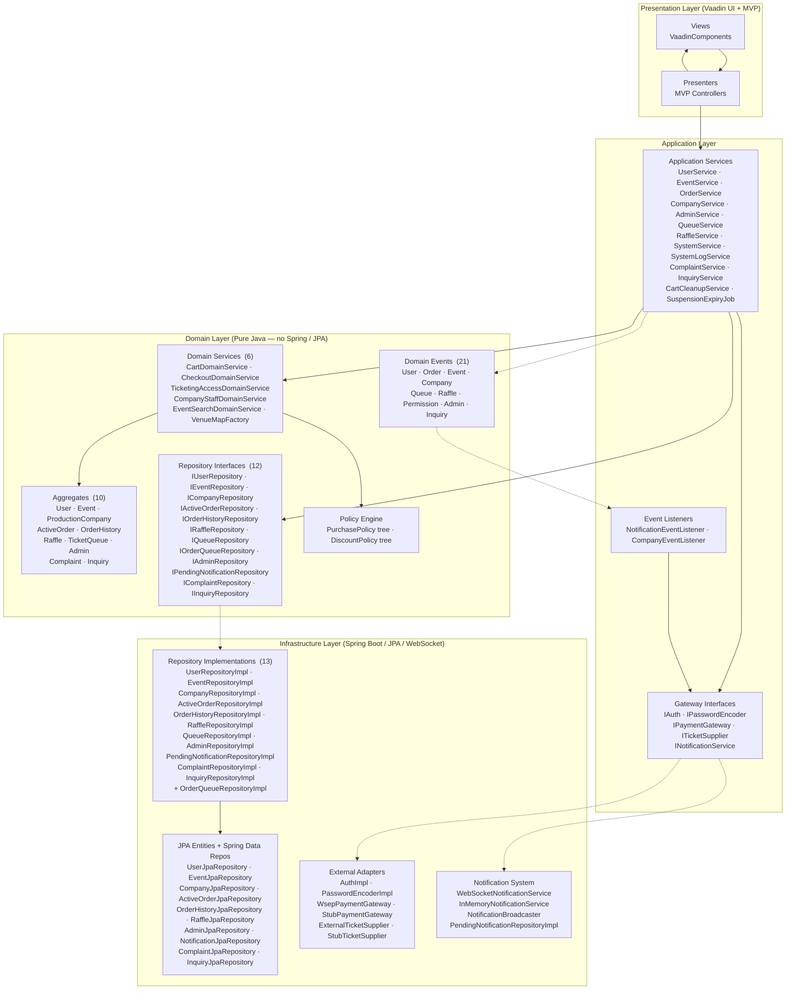

# Architecture Overview

Four-layer clean architecture. Inner layers define interfaces; outer layers implement them,
keeping all dependency arrows pointing inward.

```mermaid
graph TD
    subgraph PRES["Presentation Layer  (Vaadin UI + MVP)"]
        VIEW["Views\nVaadinComponents"]
        PRSNT["Presenters\nMVP Controllers"]
    end

    subgraph APP["Application Layer"]
        SVC["Application Services\nUserService · EventService · OrderService\nCompanyService · AdminService · QueueService\nRaffleService · SystemService · SystemLogService\nComplaintService · InquiryService\nCartCleanupService · SuspensionExpiryJob"]
        GW["Gateway Interfaces\nIAuth · IPasswordEncoder\nIPaymentGateway · ITicketSupplier\nINotificationService"]
        LISTEN["Event Listeners\nNotificationEventListener · CompanyEventListener"]
    end

    subgraph DOM["Domain Layer  (Pure Java — no Spring / JPA)"]
        AGG["Aggregates  (10)\nUser · Event · ProductionCompany\nActiveOrder · OrderHistory\nRaffle · TicketQueue · Admin\nComplaint · Inquiry"]
        DS["Domain Services  (6)\nCartDomainService · CheckoutDomainService\nTicketingAccessDomainService\nCompanyStaffDomainService\nEventSearchDomainService · VenueMapFactory"]
        REPO_IF["Repository Interfaces  (12)\nIUserRepository · IEventRepository · ICompanyRepository\nIActiveOrderRepository · IOrderHistoryRepository\nIRaffleRepository · IQueueRepository\nIOrderQueueRepository · IAdminRepository\nIPendingNotificationRepository\nIComplaintRepository · IInquiryRepository"]
        POL["Policy Engine\nPurchasePolicy tree · DiscountPolicy tree"]
        DE["Domain Events  (21)\nUser · Order · Event · Company\nQueue · Raffle · Permission · Admin · Inquiry"]
    end

    subgraph INFRA["Infrastructure Layer  (Spring Boot / JPA / WebSocket)"]
        RIMPL["Repository Implementations  (13)\nUserRepositoryImpl · EventRepositoryImpl\nCompanyRepositoryImpl · ActiveOrderRepositoryImpl\nOrderHistoryRepositoryImpl · RaffleRepositoryImpl\nQueueRepositoryImpl · AdminRepositoryImpl\nPendingNotificationRepositoryImpl\nComplaintRepositoryImpl · InquiryRepositoryImpl\n+ OrderQueueRepositoryImpl"]
        JPA["JPA Entities + Spring Data Repos\nUserJpaRepository · EventJpaRepository\nCompanyJpaRepository · ActiveOrderJpaRepository\nOrderHistoryJpaRepository · RaffleJpaRepository\nAdminJpaRepository · NotificationJpaRepository\nComplaintJpaRepository · InquiryJpaRepository"]
        EXT["External Adapters\nAuthImpl · PasswordEncoderImpl\nWsepPaymentGateway · StubPaymentGateway\nExternalTicketSupplier · StubTicketSupplier"]
        NOTIF["Notification System\nWebSocketNotificationService\nInMemoryNotificationService\nNotificationBroadcaster\nPendingNotificationRepositoryImpl"]
    end

    VIEW --> PRSNT
    PRSNT --> VIEW
    PRSNT --> SVC
    SVC --> REPO_IF
    SVC --> DS
    SVC --> GW
    SVC -.-> DE
    DS --> AGG
    DS --> POL
    DE -.-> LISTEN
    LISTEN --> GW
    REPO_IF -.-> RIMPL
    RIMPL --> JPA
    GW -.-> EXT
    GW -.-> NOTIF
```
