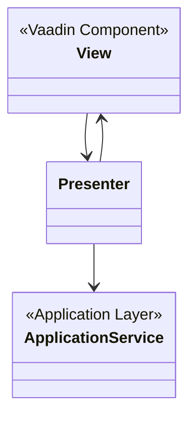
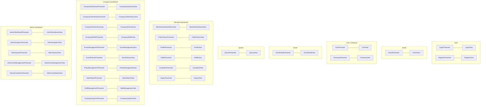

# Presentation Layer

Built on **Vaadin** with the **Model-View-Presenter (MVP)** pattern.
The View owns the UI components and fires user events; the Presenter handles logic and calls
Application Services; results flow back to the View wrapped in `Result<T>`.

## MVP Pattern

## Presenter / View Pairs by Feature Area

## Service Dependencies per Feature Area

| Feature Area | Application Services Used |
|---|---|
| Auth | `UserService` |
| Home | `EventService` |
| Cart | `OrderService` |
| Checkout | `OrderService`, `UserService` |
| Event Detail | `EventService`, `OrderService`, `QueueService`, `RaffleService` |
| Queue | `QueueService` |
| Member | `UserService`, `OrderService`, `RaffleService`, `ComplaintService`, `InquiryService` |
| Company | `CompanyService`, `EventService`, `OrderService`, `RaffleService`, `InquiryService` |
| Admin | `AdminService`, `UserService`, `SystemService`, `QueueService`, `ComplaintService` |
