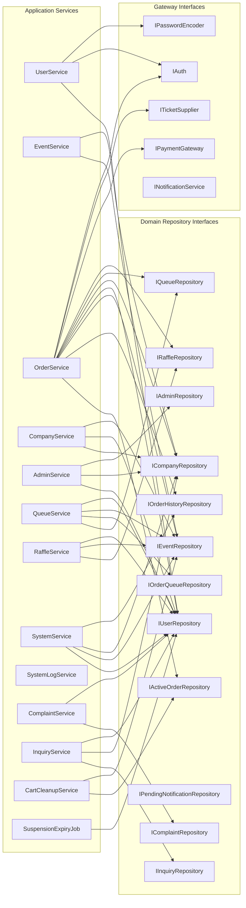
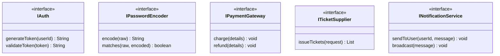

# Application Layer

Orchestrates use cases by combining Domain aggregates, Domain Services,
Repository Interfaces, and external Gateway Interfaces.
All public methods return `Result<T>` — a thin wrapper that carries either
the success value or a structured error message.

## Services and Their Dependencies

## Gateway Interfaces

## DTOs

| Domain Area | DTOs |
|---|---|
| User | `UserDTO`, `SuspensionDTO` |
| Event | `EventDTO`, `VenueMapDTO`, `ZoneDTO`, `ZoneCreationDTO`, `SeatDTO` |
| Order | `OrderDTO`, `OrderItemDTO`, `OrderHistoryDTO`, `OrderHistoryItemDTO`, `PaymentDetails` |
| Company | `CompanyDTO`, `StaffMemberDTO`, `AdminActionRequestDTO`, `SalesReportDTO` |
| Queue | `TicketQueueDTO`, `QueueStatusDTO` |
| Raffle | `RaffleDTO`, `RaffleRegistrationDTO`, `RaffleResultDTO`, `WinningTicketDTO` |
| System | `SystemAnalyticsDTO` |
| Complaint | `ComplaintDTO` |
| Inquiry | `InquiryDTO` |

## Event Listeners

| Listener | Domain Events Handled |
|---|---|
| `NotificationEventListener` | `UserSuspendedEvent`, `UserBannedEvent`, `UserReactivatedEvent`, `OrderCompletedEvent`, `CartExpiredEvent`, `CheckoutFailedEvent`, `RefundIssuedEvent`, `EventSoldOutEvent`, `EventCancelledEvent`, `EventRescheduledEvent`, `QueueTurnArrivedEvent`, `RaffleWonEvent`, `RaffleDrawnEvent`, `StaffNominatedEvent`, `StaffRemovedEvent`, `PermissionsUpdatedEvent`, `AdminMessageEvent`, `InquiryAnsweredEvent` |
| `CompanyEventListener` | `CompanySuspendedEvent`, `CompanyReopenedEvent`, `CompanyClosedByAdminEvent` |
