# Domain Layer

Pure Java — no Spring or JPA annotations. Contains all business rules and invariants.
Divided into **10 Aggregates**, **6 Domain Services**, **12 Repository Interfaces**,
a **Policy Engine** (composite pattern), and **21 Domain Events**.

---

## Aggregates

Each block is an **Aggregate**: the root class owns all child objects and is
the only entry point for external callers.

```mermaid
classDiagram
    %% ── User Aggregate ───────────────────────────────────────
    class User {
        <<abstract>>
    }
    class Guest
    class Member
    class Admin
    class UserTypeState {
        <<interface>>
    }
    class GuestState
    class MemberState
    class AdminState

    Guest --|> User
    Member --|> User
    Admin --|> User
    User --> UserTypeState
    GuestState ..|> UserTypeState
    MemberState ..|> UserTypeState
    AdminState ..|> UserTypeState

    %% ── Event Aggregate ──────────────────────────────────────
    class Event
    class VenueMap
    class Zone {
        <<abstract>>
    }
    class SeatedZone
    class StandingZone
    class Seat

    Event *-- VenueMap
    VenueMap *-- Zone
    SeatedZone --|> Zone
    StandingZone --|> Zone
    SeatedZone *-- Seat

    %% ── ProductionCompany Aggregate ──────────────────────────
    class ProductionCompany
    class CompanyStaffMember
    class AppointmentRequest

    ProductionCompany *-- CompanyStaffMember
    ProductionCompany *-- AppointmentRequest

    %% ── ActiveOrder Aggregate ────────────────────────────────
    class ActiveOrder
    class OrderItem

    ActiveOrder *-- OrderItem

    %% ── OrderHistory Aggregate ───────────────────────────────
    class OrderHistory
    class OrderHistoryItem

    OrderHistory *-- OrderHistoryItem

    %% ── TicketQueue Aggregate ────────────────────────────────
    class TicketQueue
    class QueueTicket

    TicketQueue *-- QueueTicket

    %% ── Raffle Aggregate ─────────────────────────────────────
    class Raffle
    class AuthorizationCode

    Raffle *-- AuthorizationCode

    %% ── Complaint Aggregate ──────────────────────────────────
    class Complaint

    %% ── Inquiry Aggregate ────────────────────────────────────
    class Inquiry
```

### Key Aggregate Enums and Value Objects

| Aggregate | Enums / Value Objects |
|---|---|
| User | `UserRole` (GUEST, MEMBER, ADMIN), `UserState` (ACTIVE, SUSPENDED, BANNED), `UserType` |
| Event | `EventSaleMode` (REGULAR, QUEUE, RAFFLE), `ZoneType`, `SeatStatus` (AVAILABLE, HELD, SOLD) |
| ProductionCompany | `CompanyStatus` (ACTIVE, SUSPENDED, CLOSED), `CompanyRole` (FOUNDER, MANAGER), `CompanyPermission` |
| Raffle | `RaffleStatus` (OPEN, DRAWN, CLOSED) |
| Complaint | `ComplaintStatus` |
| Inquiry | `InquiryStatus` |
| Shared | `OrderStatus` (PENDING, COMPLETED, FAILED, CANCELLED), `PurchaseContext`, `DiscountContext` |

---

## Policy Engine  (Composite Pattern)

Both policy trees can be composed to arbitrary depth.
`Event` and `ProductionCompany` each own one `PurchasePolicy` root and one `DiscountPolicy` root.
Policies are serialized to JSON for persistence via `PurchasePolicyConverter` / `DiscountPolicyConverter`.

```mermaid
classDiagram
    %% ── Purchase Policy ──────────────────────────────────────
    class PurchasePolicy {
        <<interface>>
    }
    class AllowAllPolicy
    class AgeRestrictionPolicy
    class MinTicketsPolicy
    class MaxTicketsPolicy
    class AndPolicy
    class OrPolicy

    AllowAllPolicy ..|> PurchasePolicy
    AgeRestrictionPolicy ..|> PurchasePolicy
    MinTicketsPolicy ..|> PurchasePolicy
    MaxTicketsPolicy ..|> PurchasePolicy
    AndPolicy ..|> PurchasePolicy
    OrPolicy ..|> PurchasePolicy
    AndPolicy *-- PurchasePolicy : children
    OrPolicy *-- PurchasePolicy : children

    %% ── Discount Policy ──────────────────────────────────────
    class DiscountPolicy {
        <<interface>>
    }
    class NoDiscountPolicy
    class SimpleDiscount
    class ConditionalDiscount
    class CouponDiscount
    class MaxDiscountPolicy
    class AdditiveDiscountPolicy

    NoDiscountPolicy ..|> DiscountPolicy
    SimpleDiscount ..|> DiscountPolicy
    ConditionalDiscount ..|> DiscountPolicy
    CouponDiscount ..|> DiscountPolicy
    MaxDiscountPolicy ..|> DiscountPolicy
    AdditiveDiscountPolicy ..|> DiscountPolicy
    MaxDiscountPolicy *-- DiscountPolicy : children
    AdditiveDiscountPolicy *-- DiscountPolicy : children

    %% ── Ownership ────────────────────────────────────────────
    class Event
    class ProductionCompany

    Event --> PurchasePolicy
    Event --> DiscountPolicy
    ProductionCompany --> PurchasePolicy
    ProductionCompany --> DiscountPolicy
```

---

## Domain Services

Pure Java classes with no Spring annotations. Receive aggregate objects as parameters
from Application Services — they never call repositories themselves.

```mermaid
classDiagram
    class CartDomainService {
        reserveSeatsAtomically(event, zoneId, seats, userId)
    }
    class CheckoutDomainService {
        checkout(order, event, member, payment)
    }
    class TicketingAccessDomainService {
        validateQueueAccess(queue, userId)
        pickRaffleWinners(raffle)
    }
    class CompanyStaffDomainService {
        appointStaff(company, appointerId, nomineeId, role, permissions)
        removeStaff(company, removerId, targetId)
    }
    class EventSearchDomainService {
        search(events, criteria)
    }
    class VenueMapFactory {
        create(zoneDefinitions)
    }

    CartDomainService ..> Event
    CheckoutDomainService ..> ActiveOrder
    CheckoutDomainService ..> OrderHistory
    CheckoutDomainService ..> PurchasePolicy
    CheckoutDomainService ..> DiscountPolicy
    TicketingAccessDomainService ..> TicketQueue
    TicketingAccessDomainService ..> Raffle
    CompanyStaffDomainService ..> ProductionCompany
    EventSearchDomainService ..> Event
    VenueMapFactory ..> VenueMap
```

---

## Repository Interfaces

Defined in the domain layer; implemented in the infrastructure layer.
Application Services depend on these interfaces, never on the concrete implementations.

```mermaid
classDiagram
    class IUserRepository { <<interface>> }
    class IEventRepository { <<interface>> }
    class ICompanyRepository { <<interface>> }
    class IActiveOrderRepository { <<interface>> }
    class IOrderHistoryRepository { <<interface>> }
    class IRaffleRepository { <<interface>> }
    class IQueueRepository { <<interface>> }
    class IOrderQueueRepository { <<interface>> }
    class IAdminRepository { <<interface>> }
    class IPendingNotificationRepository { <<interface>> }
    class IComplaintRepository { <<interface>> }
    class IInquiryRepository { <<interface>> }

    IUserRepository ..> User
    IEventRepository ..> Event
    ICompanyRepository ..> ProductionCompany
    IActiveOrderRepository ..> ActiveOrder
    IOrderHistoryRepository ..> OrderHistory
    IRaffleRepository ..> Raffle
    IQueueRepository ..> TicketQueue
    IAdminRepository ..> Admin
    IComplaintRepository ..> Complaint
    IInquiryRepository ..> Inquiry
```

---

## Domain Events

Published by Application Services via Spring's `ApplicationEventPublisher`.
Consumed by Event Listeners in the Application Layer.

| Category | Events |
|---|---|
| User | `UserSuspendedEvent`, `UserReactivatedEvent`, `UserBannedEvent` |
| Order | `OrderCompletedEvent`, `CheckoutFailedEvent`, `CartExpiredEvent`, `RefundIssuedEvent` |
| Event | `EventSoldOutEvent`, `EventCancelledEvent`, `EventRescheduledEvent` |
| Company | `CompanySuspendedEvent`, `CompanyClosedByAdminEvent`, `CompanyReopenedEvent` |
| Queue | `QueueTurnArrivedEvent` |
| Raffle | `RaffleDrawnEvent`, `RaffleWonEvent` |
| Permission | `PermissionsUpdatedEvent`, `StaffNominatedEvent`, `StaffRemovedEvent` |
| Admin | `AdminMessageEvent` |
| Inquiry | `InquiryAnsweredEvent` |

---

## Shared Exceptions

| Exception | Meaning |
|---|---|
| `DomainException` | Base class for all domain exceptions |
| `EntityNotFoundException` | Aggregate root not found |
| `OptimisticLockException` | Concurrent version conflict |
| `SeatUnavailableException` | Requested seat is already held/sold |
| `PaymentFailedException` | External payment gateway rejected |
| `TicketIssuanceException` | External ticket supplier failed |
| `PermissionDeniedException` | Caller lacks required permission |
| `PersistenceUnavailableException` | Database is unreachable |
| `AuthenticationException` | Invalid or expired token |
