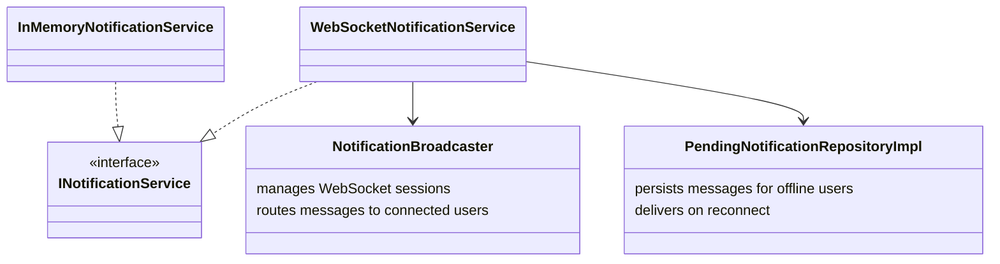

# Infrastructure Layer

Provides concrete implementations for every interface defined in the inner layers.
Contains three main concerns: **persistence** (JPA + repository impls),
**external adapters** (payment, tickets, auth), and **notification delivery** (WebSocket).

---

## Repository Implementations

Each `*RepositoryImpl` implements the corresponding domain `I*Repository` interface
and delegates persistence to a Spring Data `*JpaRepository`.

```mermaid
classDiagram
    %% Domain interfaces (defined in domain layer)
    class IUserRepository { <<interface>> }
    class IEventRepository { <<interface>> }
    class ICompanyRepository { <<interface>> }
    class IActiveOrderRepository { <<interface>> }
    class IOrderHistoryRepository { <<interface>> }
    class IRaffleRepository { <<interface>> }
    class IQueueRepository { <<interface>> }
    class IOrderQueueRepository { <<interface>> }
    class IAdminRepository { <<interface>> }
    class IPendingNotificationRepository { <<interface>> }
    class IComplaintRepository { <<interface>> }
    class IInquiryRepository { <<interface>> }

    %% Implementations
    class UserRepositoryImpl
    class EventRepositoryImpl
    class CompanyRepositoryImpl
    class ActiveOrderRepositoryImpl
    class OrderHistoryRepositoryImpl
    class RaffleRepositoryImpl
    class QueueRepositoryImpl
    class AdminRepositoryImpl
    class PendingNotificationRepositoryImpl
    class ComplaintRepositoryImpl
    class InquiryRepositoryImpl

    %% Spring Data JPA repositories
    class UserJpaRepository { <<Spring Data>> }
    class EventJpaRepository { <<Spring Data>> }
    class CompanyJpaRepository { <<Spring Data>> }
    class ActiveOrderJpaRepository { <<Spring Data>> }
    class OrderHistoryJpaRepository { <<Spring Data>> }
    class RaffleJpaRepository { <<Spring Data>> }
    class AdminJpaRepository { <<Spring Data>> }
    class NotificationJpaRepository { <<Spring Data>> }
    class ComplaintJpaRepository { <<Spring Data>> }
    class InquiryJpaRepository { <<Spring Data>> }

    UserRepositoryImpl ..|> IUserRepository
    EventRepositoryImpl ..|> IEventRepository
    CompanyRepositoryImpl ..|> ICompanyRepository
    ActiveOrderRepositoryImpl ..|> IActiveOrderRepository
    OrderHistoryRepositoryImpl ..|> IOrderHistoryRepository
    RaffleRepositoryImpl ..|> IRaffleRepository
    QueueRepositoryImpl ..|> IQueueRepository
    AdminRepositoryImpl ..|> IAdminRepository
    PendingNotificationRepositoryImpl ..|> IPendingNotificationRepository
    ComplaintRepositoryImpl ..|> IComplaintRepository
    InquiryRepositoryImpl ..|> IInquiryRepository

    UserRepositoryImpl --> UserJpaRepository
    EventRepositoryImpl --> EventJpaRepository
    CompanyRepositoryImpl --> CompanyJpaRepository
    ActiveOrderRepositoryImpl --> ActiveOrderJpaRepository
    OrderHistoryRepositoryImpl --> OrderHistoryJpaRepository
    RaffleRepositoryImpl --> RaffleJpaRepository
    AdminRepositoryImpl --> AdminJpaRepository
    PendingNotificationRepositoryImpl --> NotificationJpaRepository
    ComplaintRepositoryImpl --> ComplaintJpaRepository
    InquiryRepositoryImpl --> InquiryJpaRepository
```

### JPA Entity Notes

| Entity | Notes |
|---|---|
| `User` / `UserJpaRepository` | User is a JPA entity in the domain itself (single-table inheritance for Guest / Member / Admin subtypes) |
| `EventEntity` | Stores `PurchasePolicy` and `DiscountPolicy` as JSON columns via `PurchasePolicyConverter` / `DiscountPolicyConverter` |
| `CompanyEntity` | Same JSON-column pattern for policy trees; uses `@Version` for optimistic locking |
| `ActiveOrderEntity` | Expires after 10 minutes; `CartCleanupService` purges stale rows on a schedule |
| `PendingNotificationEntity` | Stores notifications for users who are currently offline |

---

## External Adapters

Each adapter implements a gateway interface defined in the Application Layer.

```mermaid
classDiagram
    %% Gateway interfaces (defined in application layer)
    class IAuth { <<interface>> }
    class IPasswordEncoder { <<interface>> }
    class IPaymentGateway { <<interface>> }
    class ITicketSupplier { <<interface>> }
    class INotificationService { <<interface>> }

    %% Adapters
    class AuthImpl {
        JWT token generation and validation
    }
    class PasswordEncoderImpl {
        BCrypt hashing
    }
    class WsepPaymentGateway {
        real WSEP payment service
    }
    class StubPaymentGateway {
        in-memory stub for tests
    }
    class ExternalTicketSupplier {
        real external ticket system
    }
    class StubTicketSupplier {
        in-memory stub for tests
    }
    class WebSocketNotificationService {
        real-time push via WebSocket
    }
    class InMemoryNotificationService {
        fallback in-memory impl
    }

    AuthImpl ..|> IAuth
    PasswordEncoderImpl ..|> IPasswordEncoder
    WsepPaymentGateway ..|> IPaymentGateway
    StubPaymentGateway ..|> IPaymentGateway
    ExternalTicketSupplier ..|> ITicketSupplier
    StubTicketSupplier ..|> ITicketSupplier
    WebSocketNotificationService ..|> INotificationService
    InMemoryNotificationService ..|> INotificationService
```

---

## Notification System

---

## Persistence Management

| Class | Responsibility |
|---|---|
| `PersistenceConfig` | JPA setup — entity scanning, dialect, connection pool |
| `DatabaseConnectionManager` | Connection pooling and failure handling |
| `DataSourceHealthProbe` / `InMemoryDatabaseHealthProbe` | Connection health checks |
| `PersistenceAvailabilityInvocationHandler` | JDK proxy that wraps repository calls to handle DB unavailability gracefully |
| `RepositoryAvailabilityBeanPostProcessor` | Applies the proxy to all repository beans on startup |
| `PurchasePolicyConverter` / `DiscountPolicyConverter` | JPA `AttributeConverter` — serializes policy trees to/from JSON |

---

## Bootstrap and Initialization

| Class | Responsibility |
|---|---|
| `PlatformBootstrap` | Startup orchestrator: validates connectivity, seeds admin user, loads init state, starts jobs |
| `InitialStateLoader` / `InitialStateRunner` | Reads a YAML init-state file and replays it on startup |
| `InitialStateParser` / `InitialStateExecutor` / `InitOperation` | Parse and execute init commands line by line |
| `SystemConfig` / `SystemConfigValidator` / `SystemStartupConfigValidator` | Validate startup configuration |
| `DemoDataSeeder` | Seeds demo companies, events, and users when running the `demo` Spring profile |
