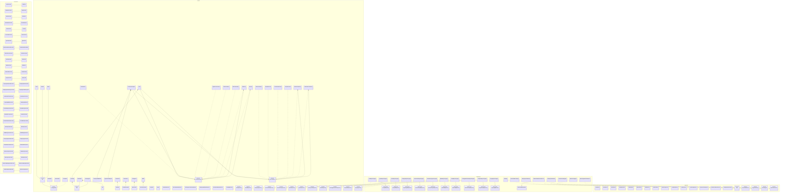

# Full System Class Diagram

```mermaid
classDiagram

%% ═══════════════════════════════════════════════════
%%  PRESENTATION LAYER
%% ═══════════════════════════════════════════════════

namespace Presentation {
    class LoginPresenter
    class LoginView
    class RegisterPresenter
    class RegisterView

    class HomePresenter
    class HomeView

    class EventDetailPresenter
    class EventDetailView

    class CartPresenter
    class CartView
    class CheckoutPresenter
    class CheckoutView

    class QueuePresenter
    class QueueView

    class MemberDashboardPresenter
    class MemberDashboardView
    class OrderHistoryPresenter
    class OrderHistoryView
    class ProfilePresenter
    class ProfileView
    class RafflePresenter
    class RaffleView
    class ComplaintPresenter
    class ComplaintView
    class InquiryPresenter
    class InquiryView

    class CompanyDashboardPresenter
    class CompanyDashboardView
    class CompanyOrderHistoryPresenter
    class CompanyOrderHistoryView
    class CompanyPoliciesPresenter
    class CompanyPoliciesView
    class CompanyRafflePresenter
    class CompanyRaffleView
    class EventManagementPresenter
    class EventManagementView
    class EventPoliciesPresenter
    class EventPoliciesView
    class PolicyManagementPresenter
    class PolicyManagementView
    class SalesReportPresenter
    class SalesReportView
    class StaffManagementPresenter
    class StaffManagementView
    class CompanyInquiriesPresenter
    class CompanyInquiriesView

    class AdminDashboardPresenter
    class AdminDashboardView
    class AdminAnalyticsPresenter
    class AdminAnalyticsView
    class AdminQueuePresenter
    class AdminQueueView
    class AdminUserManagementPresenter
    class AdminUserManagementView
    class AdminComplaintsPresenter
    class AdminComplaintsView
}

%% ═══════════════════════════════════════════════════
%%  APPLICATION LAYER
%% ═══════════════════════════════════════════════════

namespace Application {
    class UserService
    class EventService
    class OrderService
    class CompanyService
    class AdminService
    class QueueService
    class RaffleService
    class SystemService
    class SystemLogService
    class ComplaintService
    class InquiryService
    class CartCleanupService
    class SuspensionExpiryJob

    class NotificationEventListener
    class CompanyEventListener

    class IAuth {
        <<interface>>
    }
    class IPasswordEncoder {
        <<interface>>
    }
    class IPaymentGateway {
        <<interface>>
    }
    class ITicketSupplier {
        <<interface>>
    }
    class INotificationService {
        <<interface>>
    }
}

%% ═══════════════════════════════════════════════════
%%  DOMAIN LAYER
%% ═══════════════════════════════════════════════════

namespace Domain {

    %% — User aggregate —
    class User {
        <<abstract>>
    }
    class Guest
    class Member
    class Admin
    class UserTypeState {
        <<interface>>
    }
    class GuestState
    class MemberState
    class AdminState

    %% — Event aggregate —
    class Event
    class VenueMap
    class Zone {
        <<abstract>>
    }
    class SeatedZone
    class StandingZone
    class Seat

    %% — ProductionCompany aggregate —
    class ProductionCompany
    class CompanyStaffMember
    class AppointmentRequest

    %% — ActiveOrder aggregate —
    class ActiveOrder
    class OrderItem

    %% — OrderHistory aggregate —
    class OrderHistory
    class OrderHistoryItem

    %% — TicketQueue aggregate —
    class TicketQueue
    class QueueTicket

    %% — Raffle aggregate —
    class Raffle
    class AuthorizationCode

    %% — Complaint aggregate —
    class Complaint

    %% — Inquiry aggregate —
    class Inquiry

    %% — Domain Services —
    class CartDomainService
    class CheckoutDomainService
    class TicketingAccessDomainService
    class CompanyStaffDomainService
    class EventSearchDomainService
    class VenueMapFactory

    %% — Repository Interfaces —
    class IUserRepository {
        <<interface>>
    }
    class IEventRepository {
        <<interface>>
    }
    class ICompanyRepository {
        <<interface>>
    }
    class IActiveOrderRepository {
        <<interface>>
    }
    class IOrderHistoryRepository {
        <<interface>>
    }
    class IRaffleRepository {
        <<interface>>
    }
    class IQueueRepository {
        <<interface>>
    }
    class IOrderQueueRepository {
        <<interface>>
    }
    class IAdminRepository {
        <<interface>>
    }
    class IPendingNotificationRepository {
        <<interface>>
    }
    class IComplaintRepository {
        <<interface>>
    }
    class IInquiryRepository {
        <<interface>>
    }

    %% — Purchase Policy hierarchy —
    class PurchasePolicy {
        <<interface>>
    }
    class AllowAllPolicy
    class AgeRestrictionPolicy
    class MinTicketsPolicy
    class MaxTicketsPolicy
    class AndPolicy
    class OrPolicy

    %% — Discount Policy hierarchy —
    class DiscountPolicy {
        <<interface>>
    }
    class NoDiscountPolicy
    class SimpleDiscount
    class ConditionalDiscount
    class CouponDiscount
    class MaxDiscountPolicy
    class AdditiveDiscountPolicy
}

%% ═══════════════════════════════════════════════════
%%  INFRASTRUCTURE LAYER
%% ═══════════════════════════════════════════════════

namespace Infrastructure {

    %% — Repository Implementations —
    class UserRepositoryImpl
    class EventRepositoryImpl
    class CompanyRepositoryImpl
    class ActiveOrderRepositoryImpl
    class OrderHistoryRepositoryImpl
    class RaffleRepositoryImpl
    class QueueRepositoryImpl
    class AdminRepositoryImpl
    class PendingNotificationRepositoryImpl
    class ComplaintRepositoryImpl
    class InquiryRepositoryImpl

    %% — JPA Repositories —
    class UserJpaRepository {
        <<Spring Data>>
    }
    class EventJpaRepository {
        <<Spring Data>>
    }
    class CompanyJpaRepository {
        <<Spring Data>>
    }
    class ActiveOrderJpaRepository {
        <<Spring Data>>
    }
    class OrderHistoryJpaRepository {
        <<Spring Data>>
    }
    class RaffleJpaRepository {
        <<Spring Data>>
    }
    class AdminJpaRepository {
        <<Spring Data>>
    }
    class NotificationJpaRepository {
        <<Spring Data>>
    }
    class ComplaintJpaRepository {
        <<Spring Data>>
    }
    class InquiryJpaRepository {
        <<Spring Data>>
    }

    %% — Gateway Adapters —
    class AuthImpl
    class PasswordEncoderImpl
    class WsepPaymentGateway
    class StubPaymentGateway
    class ExternalTicketSupplier
    class StubTicketSupplier

    %% — Notification —
    class WebSocketNotificationService
    class InMemoryNotificationService
    class NotificationBroadcaster
}

%% ═══════════════════════════════════════════════════
%%  RELATIONSHIPS
%% ═══════════════════════════════════════════════════

%% Presenter ↔ View (MVP pairs)
LoginPresenter -- LoginView
RegisterPresenter -- RegisterView
HomePresenter -- HomeView
EventDetailPresenter -- EventDetailView
CartPresenter -- CartView
CheckoutPresenter -- CheckoutView
QueuePresenter -- QueueView
MemberDashboardPresenter -- MemberDashboardView
OrderHistoryPresenter -- OrderHistoryView
ProfilePresenter -- ProfileView
RafflePresenter -- RaffleView
ComplaintPresenter -- ComplaintView
InquiryPresenter -- InquiryView
CompanyDashboardPresenter -- CompanyDashboardView
CompanyOrderHistoryPresenter -- CompanyOrderHistoryView
CompanyPoliciesPresenter -- CompanyPoliciesView
CompanyRafflePresenter -- CompanyRaffleView
EventManagementPresenter -- EventManagementView
EventPoliciesPresenter -- EventPoliciesView
PolicyManagementPresenter -- PolicyManagementView
SalesReportPresenter -- SalesReportView
StaffManagementPresenter -- StaffManagementView
CompanyInquiriesPresenter -- CompanyInquiriesView
AdminDashboardPresenter -- AdminDashboardView
AdminAnalyticsPresenter -- AdminAnalyticsView
AdminQueuePresenter -- AdminQueueView
AdminUserManagementPresenter -- AdminUserManagementView
AdminComplaintsPresenter -- AdminComplaintsView

%% User aggregate
Guest --|> User
Member --|> User
Admin --|> User
User --> UserTypeState
GuestState ..|> UserTypeState
MemberState ..|> UserTypeState
AdminState ..|> UserTypeState

%% Event aggregate
Event *-- VenueMap
VenueMap *-- Zone
SeatedZone --|> Zone
StandingZone --|> Zone
SeatedZone *-- Seat

%% ProductionCompany aggregate
ProductionCompany *-- CompanyStaffMember
ProductionCompany *-- AppointmentRequest

%% ActiveOrder aggregate
ActiveOrder *-- OrderItem

%% OrderHistory aggregate
OrderHistory *-- OrderHistoryItem

%% TicketQueue aggregate
TicketQueue *-- QueueTicket

%% Raffle aggregate
Raffle *-- AuthorizationCode

%% Policy ownership
Event --> PurchasePolicy
Event --> DiscountPolicy
ProductionCompany --> PurchasePolicy
ProductionCompany --> DiscountPolicy

%% Purchase Policy hierarchy
AllowAllPolicy ..|> PurchasePolicy
AgeRestrictionPolicy ..|> PurchasePolicy
MinTicketsPolicy ..|> PurchasePolicy
MaxTicketsPolicy ..|> PurchasePolicy
AndPolicy ..|> PurchasePolicy
OrPolicy ..|> PurchasePolicy
AndPolicy *-- PurchasePolicy
OrPolicy *-- PurchasePolicy

%% Discount Policy hierarchy
NoDiscountPolicy ..|> DiscountPolicy
SimpleDiscount ..|> DiscountPolicy
ConditionalDiscount ..|> DiscountPolicy
CouponDiscount ..|> DiscountPolicy
MaxDiscountPolicy ..|> DiscountPolicy
AdditiveDiscountPolicy ..|> DiscountPolicy
MaxDiscountPolicy *-- DiscountPolicy
AdditiveDiscountPolicy *-- DiscountPolicy

%% Repository implementations → domain interfaces
UserRepositoryImpl ..|> IUserRepository
EventRepositoryImpl ..|> IEventRepository
CompanyRepositoryImpl ..|> ICompanyRepository
ActiveOrderRepositoryImpl ..|> IActiveOrderRepository
OrderHistoryRepositoryImpl ..|> IOrderHistoryRepository
RaffleRepositoryImpl ..|> IRaffleRepository
QueueRepositoryImpl ..|> IQueueRepository
AdminRepositoryImpl ..|> IAdminRepository
PendingNotificationRepositoryImpl ..|> IPendingNotificationRepository
ComplaintRepositoryImpl ..|> IComplaintRepository
InquiryRepositoryImpl ..|> IInquiryRepository

%% Repository implementations → JPA repositories
UserRepositoryImpl --> UserJpaRepository
EventRepositoryImpl --> EventJpaRepository
CompanyRepositoryImpl --> CompanyJpaRepository
ActiveOrderRepositoryImpl --> ActiveOrderJpaRepository
OrderHistoryRepositoryImpl --> OrderHistoryJpaRepository
RaffleRepositoryImpl --> RaffleJpaRepository
AdminRepositoryImpl --> AdminJpaRepository
PendingNotificationRepositoryImpl --> NotificationJpaRepository
ComplaintRepositoryImpl --> ComplaintJpaRepository
InquiryRepositoryImpl --> InquiryJpaRepository

%% Gateway adapter implementations
AuthImpl ..|> IAuth
PasswordEncoderImpl ..|> IPasswordEncoder
WsepPaymentGateway ..|> IPaymentGateway
StubPaymentGateway ..|> IPaymentGateway
ExternalTicketSupplier ..|> ITicketSupplier
StubTicketSupplier ..|> ITicketSupplier
WebSocketNotificationService ..|> INotificationService
InMemoryNotificationService ..|> INotificationService
WebSocketNotificationService --> NotificationBroadcaster
```
